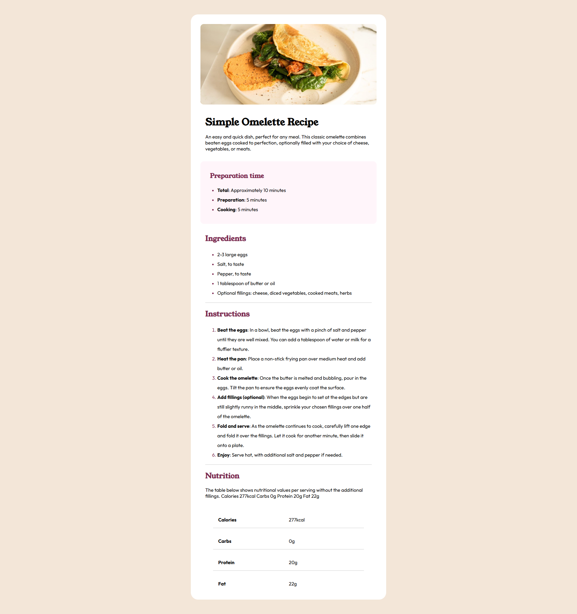

# Frontend Mentor - Recipe page solution

This is a solution to the [Recipe page challenge on Frontend Mentor](https://www.frontendmentor.io/challenges/recipe-page-KiTsR8QQKm). Frontend Mentor challenges help you improve your coding skills by building realistic projects.

## Table of contents

- [Overview](#overview)
  - [The challenge](#the-challenge)
  - [Screenshot](#screenshot)
  - [Links](#links)
- [My process](#my-process)
  - [Built with](#built-with)
  - [What I learned](#what-i-learned)
  - [Continued development](#continued-development)
  - [Useful resources](#useful-resources)
  - [AI Collaboration](#ai-collaboration)
- [Author](#author)
- [Acknowledgments](#acknowledgments)

**Note: Delete this note and update the table of contents based on what sections you keep.**

## Overview

### Screenshot

### Links

- Solution: [Solution URL](https://github.com/Zzzylo/Recipe-Page)
- Live Website: [Recipe Page](https://zzzylo.github.io/Recipe-Page/)

## My process

In this project, I built the html page with a wrapper div, with an img and section childs so it is semantic. After building the html page, I started with laying out the page, figuring out how to make the recipe card responsive to mobile and desktop view. After figuring out the layout, I started designing using the style guide. And finally, uploaded the project using git into github and passed the link in frontend mentor.

### Built with

- Semantic HTML5 markup
- CSS custom properties
- Flexbox
- CSS Grid
- Mobile-first workflow

### What I learned

In this project, I ultimately learned that the use of selector is strictly specific. For example, I wrote this code selecting the children of
the wrapper div.

`css .wrapper > *:not(:has(img)) {padding-inline: 0;margin: 0;}`

After that, I tried to ajust it in the media query in order to include the image with this selector, I just remove the pseudo classes. I did this:

`css .wrapper > * {padding-inline: 0;margin: 0;}`

Surprisingly, I faced a problem because this is a brand new selector and the selector with `css :not(:has(img)) ` i did first still falls down to the media queries and remained unchanged. This learning is huge for me since I am slowly mastering the usage of selectors and pseudo classes.

### AI Collaboration

- Claude
- As a guide to proper page layout

## Author

- Website - [Recipe page](https://zzzylo.github.io/Recipe-Page/)
- Frontend Mentor - [Zzzylo](https://www.frontendmentor.io/profile/Zzzylo)
- Github - [Zzzylo](https://github.com/Zzzylo)
